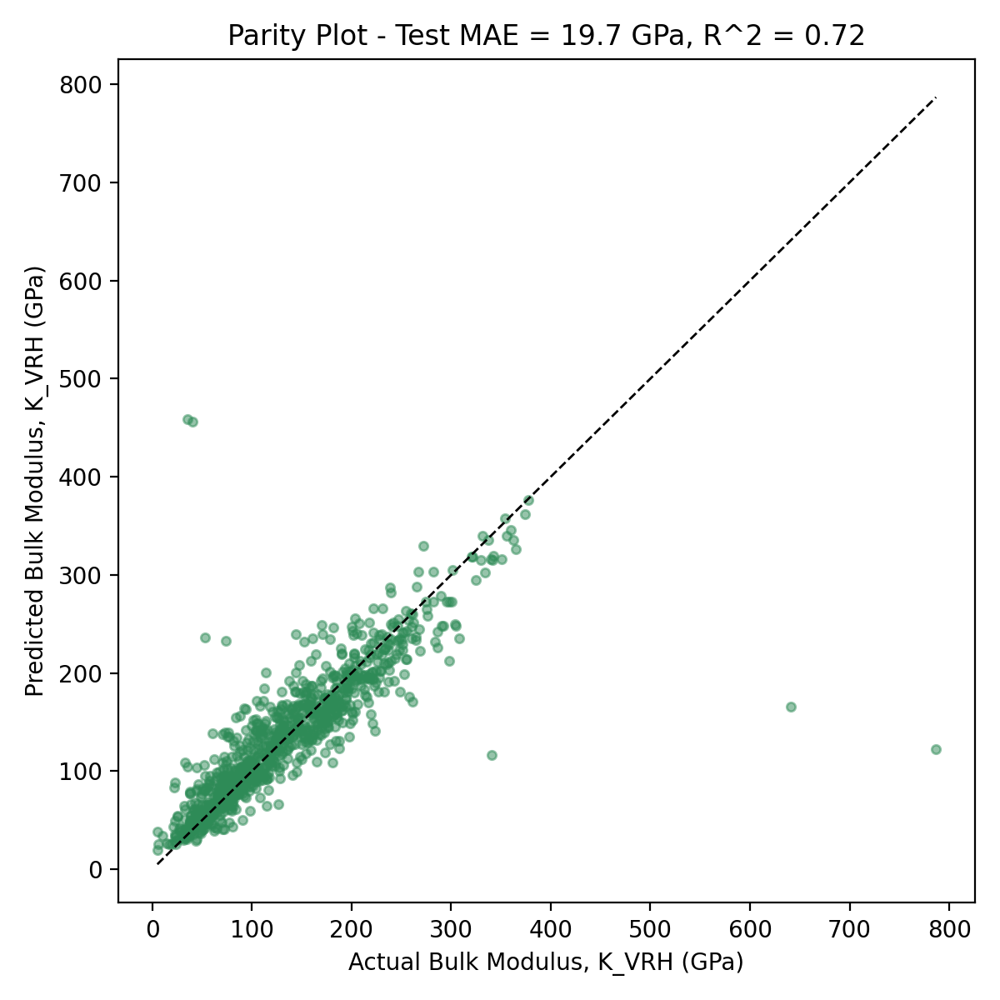

# Bulk Modulus Prediction for Transition-Metal Intermetallics

**Research question:** Can a random forest model trained on MAGPIE composition descriptors, crystal symmetry, and valence electron concentration predict the bulk modulus of transition-metal binary and ternary intermetallic compounds, using data from the Materials Project?

## Dataset

Source: [Materials Project](https://materialsproject.org) (elasticity database), accessed via the mp-api Python client.

- 5,242 ordered transition-metal binary and ternary intermetallic compounds (e.g. Fe3Ni, TiAl, Co3Ti) with computed elastic properties
- Target: bulk modulus, K_VRH (GPa)
- Note: "intermetallics" here refers to ordered crystalline compounds, not disordered solid solutions

Citation: Jain, A. et al. Commentary: The Materials Project: A materials genome approach to accelerating materials innovation. *APL Materials* 1, 011002 (2013).

## Setup

1. Clone this repository
2. Create the environment:

```
conda env create -f environment.yml
conda activate intermetallics-bulk-modulus-ml
```

3. Get a free Materials Project API key at [materialsproject.org](https://materialsproject.org)
4. Copy .env.example to .env and add your key:

```
MP_API_KEY=your_key_here
```

## Running the notebooks

Run in order:

1. `01_data_acquisition.ipynb` — queries Materials Project, filters to transition-metal binary/ternary intermetallics with elastic data
2. `02_eda_featurization.ipynb` — MAGPIE composition features, one-hot encoded crystal system, valence electron concentration (VEC), EDA plots
3. `03_modeling.ipynb` — baseline random forest with GroupKFold CV (grouped by chemical system), ablation study (MAGPIE only vs. +crystal_system vs. +VEC; random forest vs. Lasso)
4. `04_results_visualization.ipynb` — held-out test set (grouped split, no chemical system overlap between train/test), parity plot, feature importance plot

## Key results

- Baseline (full feature set): GroupKFold CV R² = 0.771 ± 0.043
- Held-out test set: MAE = 19.67 GPa, R² = 0.716
- Adding crystal_system and VEC to MAGPIE features improved performance modestly, consistent with bulk modulus depending on both composition and crystal structure



## Repository structure

```
notebooks/ — analysis notebooks, run in numbered order
data/ — processed datasets (see data/README.md)
figures/ — plots referenced in the written report
environment.yml
.env.example — copy to .env and add your MP API key
```
